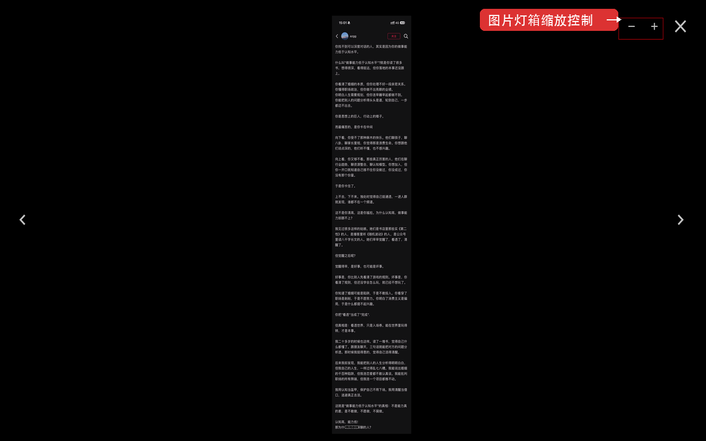

# 即刻 Web 美化

即刻 Web 的美化插件，提升阅读与交互体验。支持 Chrome（MV3）和 Firefox。

👉 [Chrome Web Store 安装](https://chromewebstore.google.com/detail/hnbakdoibeogigpihopfjfjbacfmcfck)

## 功能

### 界面与字体优化

将字体、字重、行高改为类 Twitter（Chirp）风格，并附带桌面端居中布局等体验优化。

### 用户信息悬浮卡片

鼠标悬停在正文 `@用户` 链接上时，弹出资料卡片，展示头像、昵称、简介、性别、地区、行业标签以及关注/被关注数，支持一键关注/取消关注。

- 骨架屏加载态 & 错误提示
- 深色模式自适应
- 滚动穿透：卡片上滚轮事件自动转发给页面滚动容器，同时兼容即刻原生 HoverCard
- 简介完整展示：即刻原生卡片和自定义弹出卡片均移除 2 行截断限制，hover 时可查看完整 bio（类似 Twitter/X 的行为）

### 图片灯箱缩放

在即刻自带的图片灯箱中增加缩放控制：

- 双击放大/还原
- 滚轮缩放（1×–6×）
- 拖拽平移
- 键盘快捷键：`+`/`-` 缩放、方向键与 `Space`/`Shift+Space` 平移、`0` 还原
- 工具栏缩小/放大按钮
- 切换图片时自动重置缩放状态

## 本地开发

内容脚本源码在 `src/content.js`，根目录的 `content.js` 由构建生成（与 `manifest.json` 引用一致）。

1. 安装依赖并构建：`npm install` → `npm run build`
2. 代码检查：`npm run lint`（或 `npm run check`：lint + build）
3. 打开 `chrome://extensions/`
4. 开启「开发者模式」
5. 点击「加载已解压的扩展程序」
6. 选择本项目目录
7. Firefox 调试：打开 `about:debugging#/runtime/this-firefox`，点击「临时载入附加组件」，选择项目里的 `manifest.json`

修改 `src/content.js` 后请重新执行 `npm run build` 再刷新扩展。商店 zip 可使用 `./pack.sh`（脚本内会先执行构建）。

## 调试说明

- 开启调试日志：在控制台执行 `localStorage.setItem("JIKE_POLISH_DEBUG", "1")`
- 关闭调试日志：`localStorage.removeItem("JIKE_POLISH_DEBUG")`

## 测试页面

- 正文 @提及 + 原生 HoverCard：<https://web.okjike.com/u/28e960ee-9e3a-45bb-bee3-d859b34416c1/repost/69c14cecc5a1d4e6497efb7d>
- 长 bio 用户（龙翊Longyi）：<https://web.okjike.com/u/5ca1f20e-e12f-4792-8e1c-bffb2cf1c932>

